# Programación con JavaScript

Este repositorio cuenta con notas, ejemplos y ejercicios completos elaborados con JavaScript Vanilla.

## Lista de contenido

1. [Descripción](#descripción)
2. [Características](#características)
3. [Requisitos](#requisitos)
4. [Instalación](#instalación)
5. [Uso](#uso)
6. [Estructura del proyecto](#estructura-del-proyecto)
7. [Contribuciones](#contribuciones)
8. [Licencia](#licencia)

## Descripción

El objetivo de este proyecto es ayudar a brindar conocimiento sobre temas importantes de Javascript, desde variables, funciones, ciclos, estructuras de control hasta temas un poco mas complejos como callbacks, algoritmos de ordenamiento y busqueda.

Esta hecho para que programadores puedan mejorar aún mas sus habilidades y destaquen con ello.

## Características

- Ejemplos practicos con codigo comentado
- Explicaciones en conceptos intermedios y avanzados

## Requisitos

Para su uso es recomendable tener Node.js instalado, aunque tambien podrias utilizar una extension como lo es Quokka.js, la cual te brinda visualización de los resultados en el editor de texto, a diferencia de Node.js que lo hace por terminal.

## Instalación

1. Clona este repositorio:
   ```bash
   git clone https://github.com/tu-usuario/tu-repositorio.git

   ```
2. Instala las dependencias
   ```bash
   npm install

   ```

## Uso

Revisar los archivos de codigo fuente, cada archivo contiene ejemplos y descripciones necesarias

## Estructura del proyecto

```mermaid

graph TD;
    A[./1-Introduccion-JS] --> B[DesafioPractico]
    B --> C[desafioPractico1.js]
    A --> D[proyecto_calculadora]
    D --> E[calculadora.js]
    D --> F[package-lock.json]
    D --> G[package.json]
    A --> H[1-DECLARACION_VARIABLES.js]
    A --> I[2-CONCATENACION_INTERPOLACION.js]
    A --> J[3-OPERADORES_ARITMETICOS.js]
    A --> K[4-OPERADORES_RELACIONALES.js]
    A --> L[5-FUNCIONES.js]
    A --> M[6-PARAMETROS.js]
    A --> N[7-RETORNOS_SCOPE.js]
    A --> O[8-IF_ELSE.js]
    A --> P[9-CONDICIONALES_MUL_ANIDADOS.js]
    A --> Q[10-IF_TERNARIO.js]
    A --> R[11-SWITCH.js]
    A --> S[12-VAR_VS_LET.js]

    T[./2-Javascript_Intermedio] --> U[DesafioPractico]
    U --> V[desafioPractico2.js]
    T --> W[proyecto_task_manager]
    W --> X[task_manager.js]
    T --> Y[1-WHILE.js]
    T --> Z[2-DO_WHILE.js]
    T --> AA[3-FOR.js]
    T --> AB[4-INTRO_ARR.js]
    T --> AC[5-ALG_CLASICOS_ARR.js]
    T --> AD[6-METODOS_ARR.js]
    T --> AE[7-METODOS_STR.js]
    T --> AF[8-OBJETOS_LITERALES.js]

    AG[./3-Javascript_avanzado] --> AH[1-INTRO_MATRICES.js]
    AG --> AI[2-RECORRER_MAT.js]
    AG --> AJ[3-FILTRAR_MAT.js]
    AG --> AK[4-TIPOS_FUNCIONES.js]
    AG --> AL[5-CALLBACKS.js]
    AG --> AM[6-METODOS_ARR_AVANZADOS.js]
    AG --> AN[7-M_METODOS_ARR.js]

```



## Contribuciones

Las contribuciones son bienvenidas. Si tienes alguna mejora o quieres agregar más ejemplos, por favor crea un pull request.

## Licencia

Este proyecto está bajo la Licencia MIT - consulta el archivo LICENSE para más detalles.
